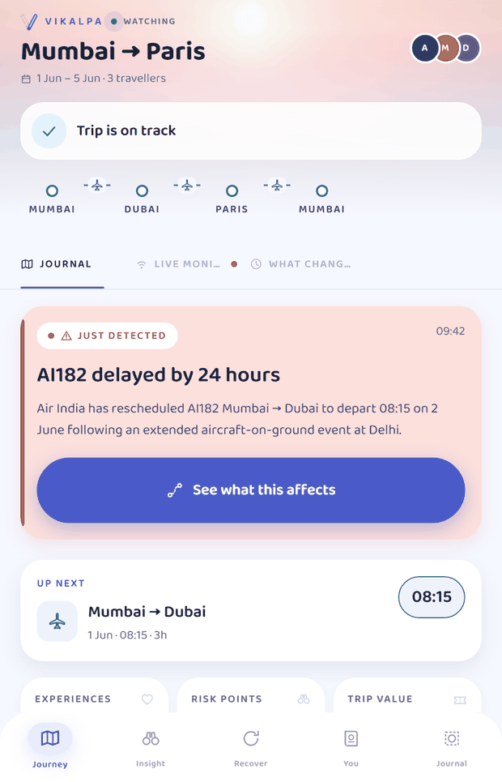
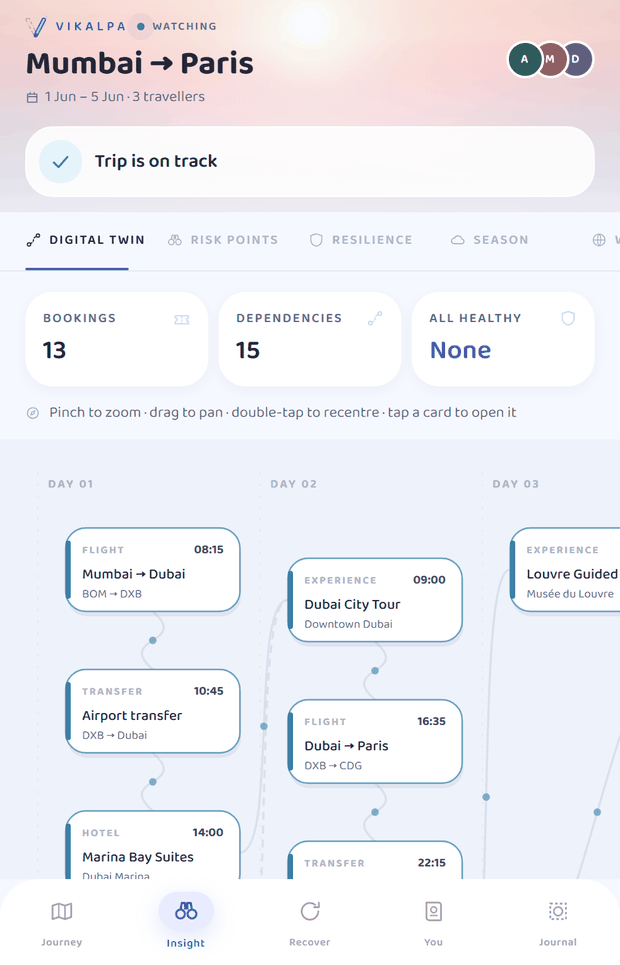
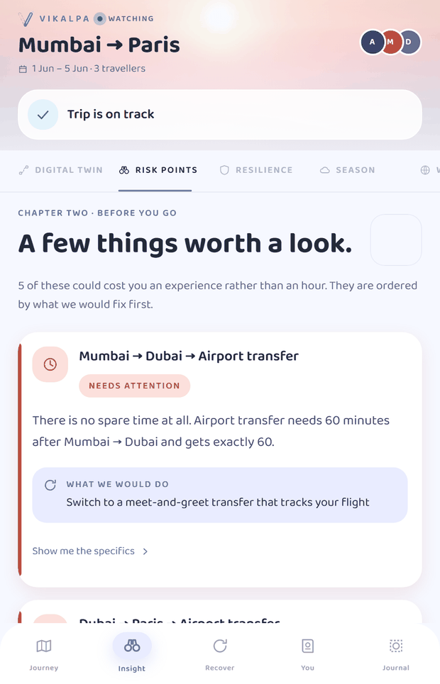
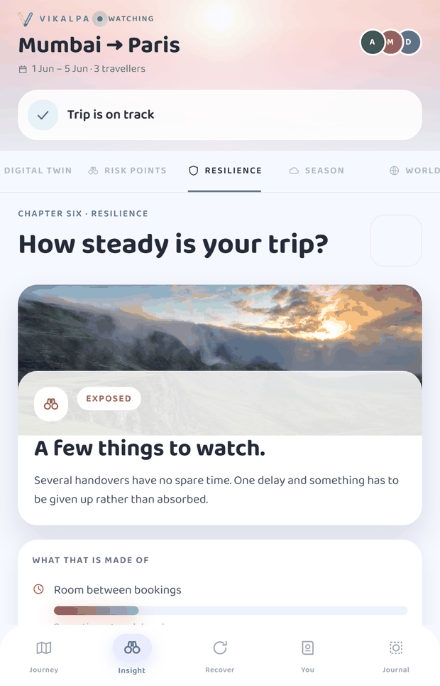
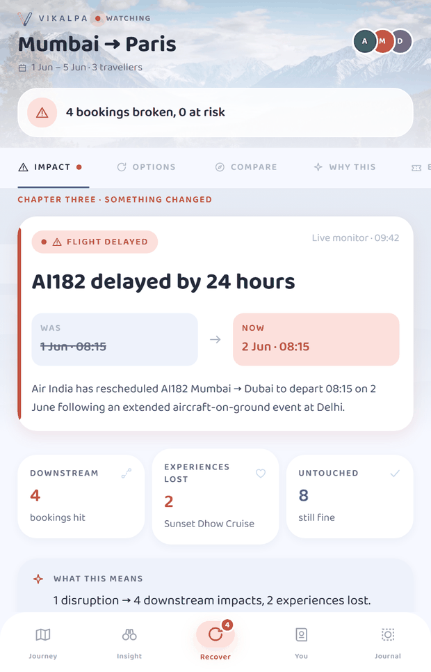
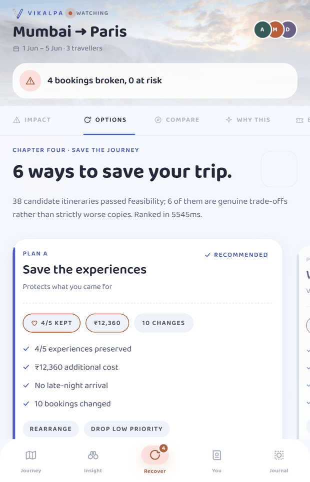

<div align="center">


# VIKALPA

**विकल्प** — *alternative; another possible way*

### हर सफ़र का एक और रास्ता।
##### When plans change, find another way.

<br/>

[](https://docs.expo.dev/versions/v57.0.0/)
[](https://reactnative.dev)
[](https://www.typescriptlang.org)
[](https://nodejs.org)
[](#getting-started)
[](#verification)

<br/>

> ### Don't just tell me my flight is delayed.<br/>Tell me what it *breaks*.<br/>Then show me the best way forward.

</div>

---

## The idea

Every travel app can tell you your flight is delayed. None of them tell you what that delay **costs** you.

VIKALPA reads your itinerary as a **dependency graph** — so it knows your airport transfer, your first hotel night and your sunset cruise all hang off that one flight. When the flight slips, a deterministic engine traces the damage through the graph, generates real alternatives, checks every one against physical and contractual reality, keeps only the genuine trade-offs, ranks them under *your* priorities, and explains why it recommends the one it does.

You accept a plan, and the itinerary rebuilds in front of you.

<table>
<tr>
<td width="50%" valign="top">

#### What it is

A **resilience layer** over a trip you have already booked. It assumes you have the bookings and asks a different question: *how much does this trip bend before it breaks, and what do you do when it does?*

</td>
<td width="50%" valign="top">

#### What it is not

Not a booking app. Not a weather app. Not an itinerary planner. Not a chatbot. There is no live inventory and no machine learning — and the app says so, on screen, wherever it matters.

</td>
</tr>
</table>

---

## Screens

<table>
<tr>
<td align="center" width="25%"><br/><sub><b>Splash</b><br/>a path being found</sub></td>
<td align="center" width="25%"><br/><sub><b>Onboarding</b><br/>dawn → storm → dusk</sub></td>
<td align="center" width="25%"><br/><sub><b>Journey</b><br/>the living itinerary</sub></td>
<td align="center" width="25%"><br/><sub><b>Digital twin</b><br/>what holds it together</sub></td>
</tr>
<tr>
<td align="center"><br/><sub><b>Risk points</b><br/>weak spots, in plain words</sub></td>
<td align="center"><br/><sub><b>Resilience</b><br/>a sky, not a score</sub></td>
<td align="center"><br/><sub><b>Impact</b><br/>1 change → 4 consequences</sub></td>
<td align="center"><br/><sub><b>Options</b><br/>38 feasible → 6 real choices</sub></td>
</tr>
</table>

---

## How it works

```
  ①  IMPORT          read the itinerary you already have
  ②  DIGITAL TWIN    build it as a dependency graph — what each booking needs
                     before it can start, and what it releases when it ends
  ③  FIND WEAK SPOTS seven checks: tight handovers, weather-exposed experiences,
                     unrecoverable money, single points of failure, dense days,
                     late-night arrivals, no buffer anywhere
  ④  MONITOR         map world signals onto the specific bookings they touch —
                     or say plainly that they touch none
  ⑤  DETECT          a disruption arrives, or you report one
  ⑥  CASCADE         propagate the consequence and label every downstream
                     booking. This step NEVER proposes a fix
  ⑦  RECOVER         generate candidates from real inventory, then put every one
                     through a hard feasibility gate
  ⑧  CHOOSE          keep only genuine trade-offs, rank under your priorities,
                     explain the recommendation
  ⑨  REBUILD         you accept; the itinerary reassembles in place
  ⑩  KEEP WATCHING   back to ④
```

---

## The reference scenario

**Mumbai → Dubai → Paris.** 1–5 June, three travellers, **13 bookings**, **15 dependencies**, five experiences.

Then the first flight is delayed 24 hours:

```
1 disruption → 4 downstream impacts, 2 experiences lost

  DISRUPTED   Mumbai → Dubai
  MISSED      Airport transfer     departs 10:45 on 1 Jun; you are not
                                   free until 2 Jun
  CANCELLED   Marina Bay Suites    you arrive after the 12:00 checkout —
                                   the whole stay is lost
  MISSED      Sunset Dhow Cruise   your booked sailing goes ahead without you
  MISSED      Dubai City Tour      would have to end by 13:35 to keep EK073
  SAFE        …8 more bookings untouched
```

**38 candidates** pass feasibility. **6** are genuine trade-offs. The recommended plan keeps **4 of 5 experiences** for **₹12,360** extra with **no late-night arrival** — by moving the cruise to Day 2, rebooking onto the next morning's Dubai → Paris flight, sliding the Louvre and Montmartre a day each, and letting go of the city tour.

Three things the engine works out on its own along the way:

| | |
|---|---|
| 🎟️ | One flight would have saved **all five** experiences — but it has **2 seats left** and the party is **3**. Shown as blocked, with the reason, not hidden. |
| 🏛️ | The **Louvre is closed on Tuesdays**, which rules out an otherwise tempting reshuffle. |
| ✈️ | An overrunning walking tour **does not delay a departing A380**. The flight leaves on time and the tour is what gets cut. |

---

## Architecture

```
┌─ mobile/  Expo · React Native · TypeScript ──────────────────────────┐
│                                                                     │
│   app/                 12 route files — 5 destinations, 25 chapters  │
│   src/segments/        23 screen bodies                             │
│   src/components/      16 shared components                         │
│   src/theme/           one design system                            │
│   src/state/store.ts   ONE Zustand store: one living trip           │
│   src/api/client.ts    single API boundary + offline fallback        │
│                                                                     │
└──────────────────────────────┬──────────────────────────────────────┘
                               │  21 endpoints + /api/health
┌──────────────────────────────┴──────────────────────────────────────┐
│  server/  Node · Express · TypeScript                               │
│                                                                     │
│   routes/trips.ts      thin shells — zero business logic            │
│   engine/              11 modules, 2,858 lines, fully deterministic  │
│   data/                seeded JSON with foreign keys                │
│                                                                     │
└─────────────────────────────────────────────────────────────────────┘
```

### The engine

| Module | Lines | Job |
|---|--:|---|
| `recoveryPlanner.ts` | 535 | candidate generation, repair, Pareto front |
| `cascadeEngine.ts` | 358 | disruption → consequence |
| `assistant.ts` | 312 | natural-language intent extraction |
| `ranker.ts` | 293 | multi-objective scoring, archetype selection |
| `riskEngine.ts` | 291 | vulnerabilities + resilience score |
| `validator.ts` | 269 | the hard feasibility gate — 10 checks |
| `explain.ts` | 135 | deterministic natural language |
| `graph.ts` | 130 | the dependency DAG |
| `time.ts` | 116 | offset-aware time arithmetic |
| `parser.ts` | 90 | itinerary → structured trip |
| `scenarios.ts` | 71 | what-if, against a throwaway copy |

---

## Design decisions worth knowing

<details>
<summary><b>The cascade answers exactly one question — and never proposes a fix</b></summary>

<br/>

*"If nobody does anything, what breaks?"* That is the whole contract. Keeping propagation and recovery separate makes the two hardest parts of the problem independently testable, and it means the damage report can never be quietly softened by the existence of a fix.

</details>

<details>
<summary><b>An overrunning activity does not delay a departing flight</b></summary>

<br/>

Edges like *"the city tour must end 3h before EK073"* encode a **constraint**, not causality. The forward pass skips them; a backward pass then resolves the conflict in the honest direction — the tour gets cut, the flight leaves on time.

Without this, the engine reported 7 impacts instead of 4 and claimed a walking tour had delayed an Airbus A380.

</details>

<details>
<summary><b>A hotel hands off twice</b></summary>

<br/>

Check-in unblocks the evening's plans; check-out releases you to the airport. `readyTime(node, edge)` picks the right one from the edge type. Without it the engine either thinks you are free at 15:00 on day 3, or trapped until day 5.

</details>

<details>
<summary><b>The validator is the boring, strict part</b></summary>

<br/>

Ten checks run on every candidate. A **hard** violation removes the plan from the deck entirely — it is never merely ranked lower, so you are never shown a plan that cannot happen.

| Check | |
|---|---|
| Travel time valid | every handover keeps its minimum gap |
| Activity open | inside published hours, and not on a closed day |
| Inventory available | seats *and* places for your actual party size |
| No double-booking | nothing overlaps anything else |
| Accommodation covered | a booked stay across every local midnight |
| In the right city | each experience happens while you are actually there |
| Daily travel ceiling | under the agreed hours per day |
| Late-night preference | no arrivals 23:00–05:00 if you asked |
| Verified transfers | ground transport uses vetted operators |
| Priorities respected | must-do and group-priority items are kept |

</details>

<details>
<summary><b>Only the Pareto front is shown</b></summary>

<br/>

A plan that is worse on cost **and** experiences **and** churn than another plan is not a choice, it is clutter. Five axes, oriented so higher is better, then strict dominance:

```ts
a.every((v, i) => v >= b[i]) && a.some((v, i) => v > b[i])
```

38 feasible candidates collapse to 6 real ones.

</details>

<details>
<summary><b>"Time" includes usable hours at the far end</b></summary>

<br/>

Two flights of identical duration are not identical trips: landing in Paris at 13:35 buys you an afternoon that landing at 20:30 does not. Without this axis the optimizer happily recommended the cheaper, later flight.

</details>

<details>
<summary><b>Preference weights are sharpened before normalising</b></summary>

<br/>

Five linearly normalised sliders let the sum of four secondary preferences outvote the one you actually called out. Squaring fixes it — at exponent 2 an 85 leads a 45 decisively rather than marginally.

```ts
weight = value² / Σ(all values²)
```

This is a **product judgement**, stated as one in the UI, not a measured model of anyone's utility.

</details>

<details>
<summary><b>The language model reads intent — it never plans</b></summary>

<br/>

Given *"I don't care about the extra cost, I just can't miss the cruise"* it emits constraints: budget sensitivity low, that activity must-do. The deterministic engine does all the proposing, validating, ranking and explaining.

The boundary is enforced structurally, not by prompt alone: a strict tool schema with `additionalProperties: false`, preferences clamped to 0–100 on our side, and node ids filtered against the real trip so an invented id is silently dropped. **A model that cannot invent an itinerary cannot hallucinate one** — and with no API key a 13-rule reader does the same job offline.

</details>

<details>
<summary><b>No assumptions from gender or age</b></summary>

<br/>

Traveller preferences come from explicit declared sliders and priorities only. Nothing anywhere in the codebase infers preference from demographics.

</details>

---

## The interface

A **calm travel companion** — soft pastel skies, rounded friendly type, real landscape scenery framing the content. Every booking is a soft rounded panel; emphasis comes from light and colour temperature rather than borders and rules. Depth is RN `transform` plus diffuse cool shadows and coloured glows — no WebGL, no blur stacks.

Behind the masthead sits a **scene band whose sky follows the trip's phase**: dawn while watching, overcast when something has broken, dusk once it is settled. *The weather is the status.* During an active disruption the **Recover** tab turns coral and carries a count, so the app itself tells you where to go.

| Layer | Where |
|---|---|
| Palette, type scale, elevation, glow, motion, reduced-motion hook | `src/theme/index.ts` |
| Scenery — `SkyGradient`, `Scene`, `SceneBackdrop`, `SceneThumb` | `src/components/scene/Scene.tsx` |
| 42 line-art glyphs on a 24-grid, with a badge system for combinations | `src/components/travel/TravelIcon.tsx` |
| Surfaces — `PaperCard`, `PopUpCard`, `TravelTicket`, `Stamp`, `LuggageTag` | `src/components/travel/paper.tsx` |
| `ItineraryCanvas` — the hero: the itinerary, healing in place | `src/components/travel/ItineraryCanvas.tsx` |
| Type, controls, meters, scaffolding, `StickyCTA` | `src/components/primitives.tsx` |

**Type** is one bundled family — **Baloo 2** at four weights, loaded with `expo-font` behind a held splash so there is no flash of unstyled text. It was the only rounded candidate carrying every glyph the app renders: M PLUS Rounded 1c has no `₹` and no Devanagari, and Nunito has `₹` but no `→` or `↓`. A second family that renders a box on the price line is worse than one family that renders everything.

**Imagery** is free-license only, always layered *over* a hand-built gradient sky — so a slow network, an offline session or a dead URL degrades to intentional art rather than a grey box. Text never sits on a raw photograph.

**Motion** is calm when healthy, sharper under disruption, settling once recovered: 140–480 ms, with the itinerary rebuild the one animation allowed to breathe at 620 ms. Everything honours the OS *reduce motion* setting and collapses to an instant state change.

---

## Numbers the traveller never sees

The engine scores resilience 0–100, ranks plans on five weighted axes, and assigns each risk a recoverable-points figure. **None of those numbers reach the UI.** A number invites arguing with the arithmetic; a sentence invites doing something.

| Instead of | You see |
|---|---|
| `resilience: 59 / 100` | *"A few things to watch."* + five unlabelled component fills |
| `severity: MEDIUM` | *Worth watching* |
| `resilienceDelta: +9` | *"Switch to a meet-and-greet transfer that tracks your flight"* |
| `scores.total: 78.4` | **Most kept** · **Cheapest** · **Calmest** · **Safest** · **Fastest** · **Gentlest** |

Money (`₹`) and durations stay visible, because those are real quantities. The hidden numbers still do all the ranking and ordering underneath.

---

## Getting started

Two processes. **Node 20+.**

```bash
git clone https://github.com/vrxshxli/Vikalpa.git
cd Vikalpa
npm run install:all

npm run server     # terminal 1 → http://localhost:4000
npm run mobile     # terminal 2 → Expo; press w for web, or scan the QR
```

**On a physical phone** — same Wi-Fi as the laptop, Expo Go on **SDK 57**. The app derives the API host from the Expo dev-server host, so there is no IP to edit. If the API is unreachable, every screen falls back to a precomputed engine snapshot and the masthead reads *SAVED COPY* instead of *WATCHING* — a demo never shows a blank screen, and what you see is still real engine output.

<details>
<summary><b>Development commands</b></summary>

<br/>

```bash
npm run typecheck                      # both packages
npm run snapshot                       # regenerate the offline snapshot
                                       # and print the demo scenario
npx tsx server/src/scripts/debug.ts    # cascade table, feasibility
                                       # violations, risk list
```

An `ANTHROPIC_API_KEY` in the server environment switches the recovery assistant's intent extraction from the built-in rule reader to Claude. Entirely optional.

`server/src/types.ts` and `mobile/src/types/domain.ts` are kept identical below their headers. If you change one, copy it across.

</details>

---

## Verification

| | |
|---|---|
| **Typecheck** | 0 errors across both packages, 0 dead imports |
| **Bundles** | Android 11.3 MB · iOS 10.9 MB · web — all clean |
| **Runtime** | all 5 destinations render, 0 console errors, 0 exceptions |
| **Journey regression** | healthy → cascade → deck → before/after → rebuilt trip |
| **Responsive** | 0 horizontal overflow at 360 / 390 / 412 / 768 / 1024 / 1440 |
| **Reduced motion** | full content in final state, nothing hidden, 0 exceptions |
| **Touch targets** | 0 interactive targets under 44 px |
| **Contrast** | 0 body-text pairs under 4.5:1 |

Ten engine correctness bugs were found and fixed during the build — cascade over-propagation, hotel hand-off ambiguity, degenerate score normalisation, a padded plan deck, and a dangling-edge 500 after a plan dropped a booking among them.

---

## Honesty

Stated in the product, not just here:

- **All inventory is seeded demo data.** Prices, seat counts and availability are fabricated to make a specific scenario legible, and the UI says so wherever a price appears. Nothing claims to be live market data.
- **The preference weights are a stated trade-off** from your own sliders, not a measured model of human utility.
- **The five resilience components are weighted by product judgement**, not by a validated model — and they are shown broken down so you can disagree with the weighting and still read the parts.
- **There is no machine learning in the system today.** The clear places for it are named below, and the interfaces already exist.

<details>
<summary><b>Where ML would go — and where it must not</b></summary>

<br/>

Three insertion points already exist; nothing above them would have to change.

| Boundary | What slots in |
|---|---|
| `ItineraryParser` | a document extraction model, giving genuine per-field confidence |
| `data/index.ts` | real inventory and availability forecasting |
| `RiskSignal` | delay prediction, weather models, confidence calibration |

Ranked by value × feasibility: **parser confidence** (today it is a fixed per-kind rule, not a measurement), **delay prediction** (the biggest product gap — disruptions are currently detected, never forecast), and **connection-time estimation** (which would directly improve the strongest score in the system).

**Where it must not go:** the cascade engine is a DAG traversal, and ML there would be strictly worse and would destroy *"why did this break?"*. The validator enforces facts — the Louvre being closed on Tuesday is not a prediction. The Pareto front is dominance maths. Two seats against a party of three is arithmetic.

> ML belongs on the **inputs** — estimation, prediction, calibration — and on **ranking within the feasible set**. Never on feasibility or causality. The same rule that constrains the language model today, extended.

</details>

---

<div align="center">
<sub>Built with React Native, Expo and TypeScript · <b>76 files, 18,732 lines</b> of application code</sub>
<br/><br/>
<sub><b>हर सफ़र का एक और रास्ता।</b></sub>
</div>
